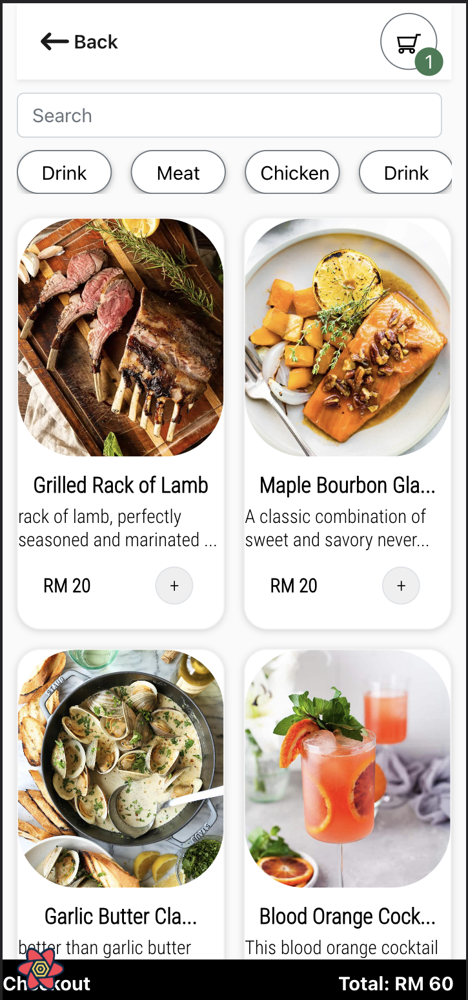
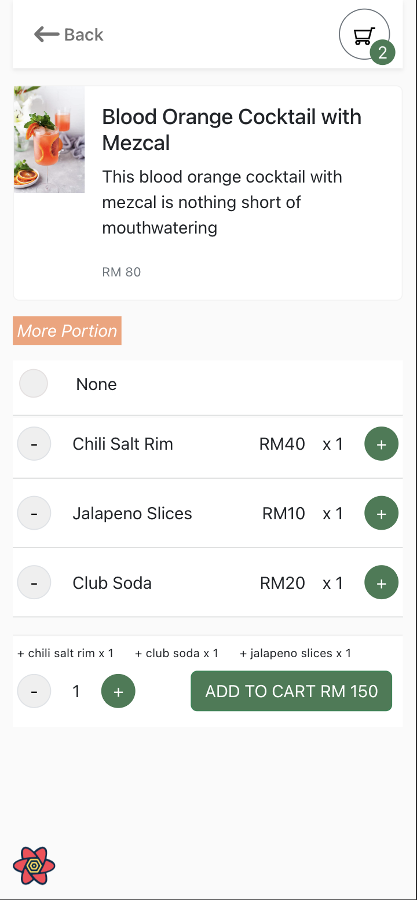
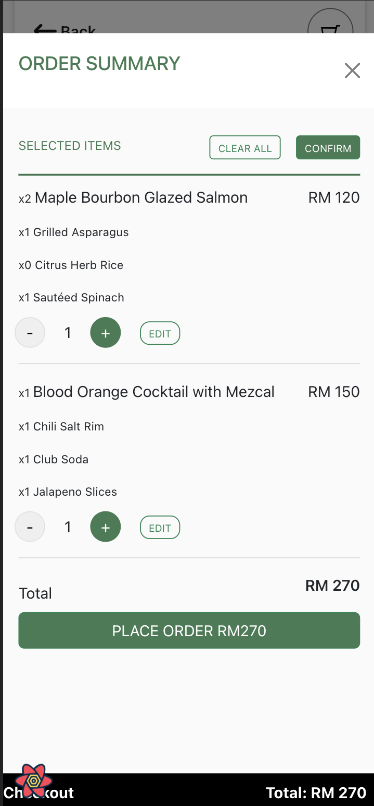
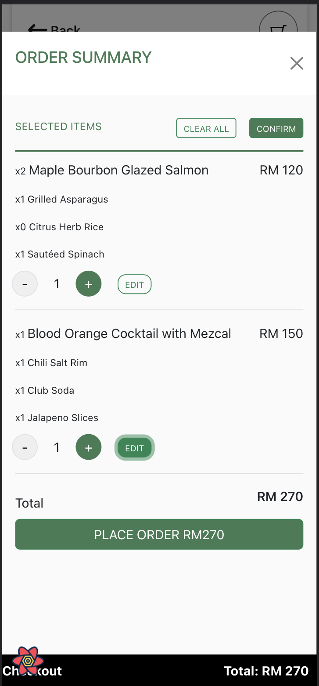
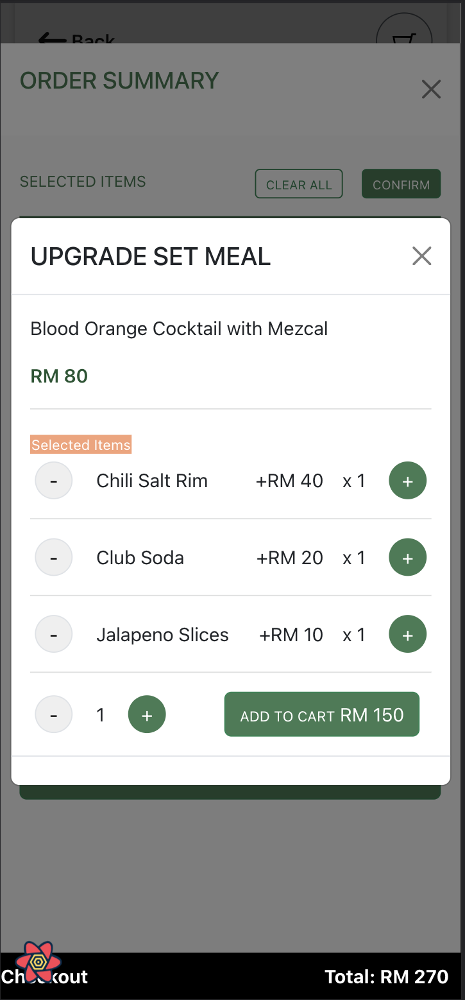
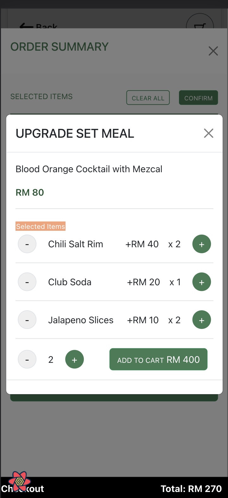
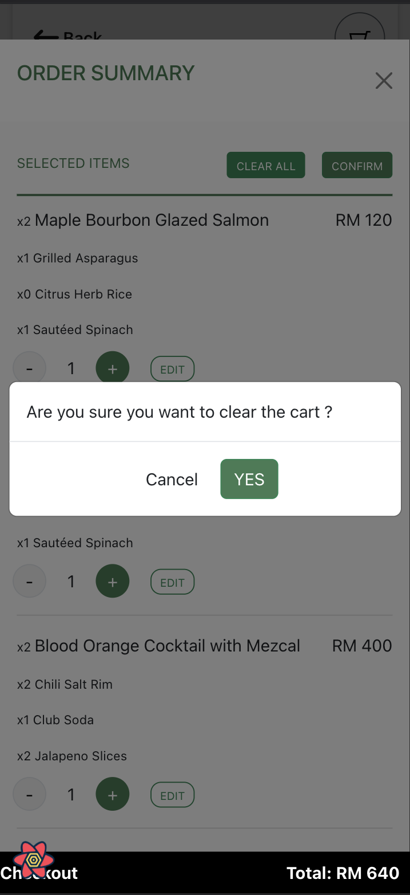
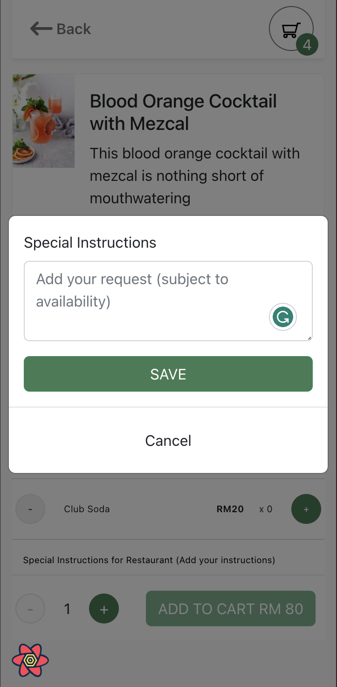

# Restaurant

The restaurant is a user-friendly web application that revolutionizes the dining experience by allowing customers to conveniently customize and place their orders directly from their smartphones. With an intuitive interface and a range of features, The restaurant simplifies the ordering process and enhances customer satisfaction.
The web application is designed to streamline the ordering process, improve order accuracy, and provide a convenient experience for customers. Whether you're dining in or opting for takeout, the restaurant empowers you to personalize your orders and have them prepared to your liking.

Key Features:

- Menu Customization: Personalize your orders by selecting specific ingredients, toppings, and customization options for each item.
- Seamless Ordering: Browse the menu, add items to your cart, and place your order with just a few taps.
- Real-Time Updates: Receive instant updates on the status of your order, including preparation, cooking, and estimated delivery or pickup times. (Coming Soon)
- Special Requests: Add special requests or dietary preferences for specific items, ensuring your order is prepared to your preferences.
- Secure Payments: Make hassle-free payments directly through the app, using a range of secure payment options. (Coming Soon)
- Order History: Access your order history, review past orders, and easily reorder your favorite items. (Coming Soon)
- Loyalty Rewards: Earn loyalty points or rewards for frequent orders, encouraging customer loyalty and repeat business. (Coming Soon)

## Getting Started

Clone this repository

cd backend
npm run start:dev

cd frontend
npm run start

